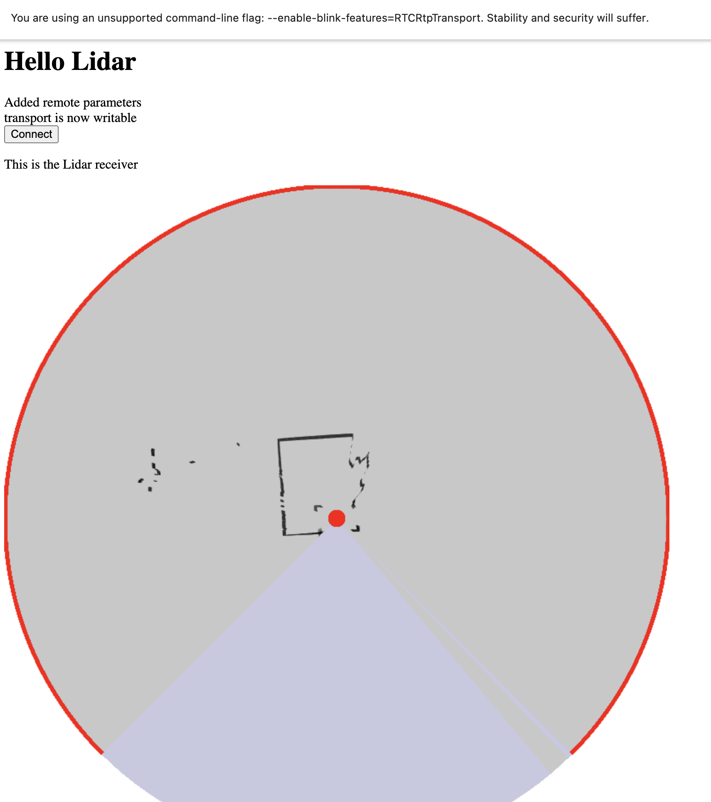

# Simple demo hack for displaying RichBeam Lidar over RTCTransport

## background
This hack follows on from [a talk I gave at Kamilio World 2025](https://www.youtube.com/watch?v=wpHojBJ6nLI)
Where I connected an industrial lidar to a browser over WebRTC.
Much of the talk covered why this wasn't the ideal transport in summary:
1) there isn't an RTP codec for Lidar data 
2) The dtatachannel makes assumptions about loss and congestion that aren't valid for this usecase

## Lidar packets 
The data from the RichBeam Lidar is formed of 1200 byte packets that represent a small arc (3 degrees) of it's total view angle.
The packets are idempotent, containing a timestamp and the start angle for the data. Data from each point will be sent 30 times a second.
A total of 240 packets a second  (~2.9 Mbit/s)
Misordering largely does not matter. Lost packets simply mean that a segment of the display will be out of date.

## RTCTransport
RTCTransport is an experimental API that allows Peer-to-peer exchange of DTLS datagrams between browsers.

It provides no reliability or sequencing to the datagrams, it is a essentially a raw encrypted transport.

This fits in nicely with the RichBeam data stream.

## Implementation
We used open source implementations of ICE and DTLS to create a simple RTCTransport server which takes local UDP packets from the RichBeam, wraps them in DTLS and sends them over 
an ICE transport. This is received by Chrome with the  `--enable-blink-features=RTCRtpTransport` flags set.

The Java Simple webserver handles the static `index.html` file and the offer-answer POST necessary to create the transport.

## Issues
We noticed some limitations when implementing this:
- There is no event when ICE has completed gathering candidates (unlike PeerConnection) - this makes it difficult to know when to POST the `offer`
- There is no way to access the L4S ecn data on incomming packets. (this could be a field on the incomming message)
- There is no way to specify the certificate to be used on the connection (unlike PeerConnection) - this would be very useful for COAP like services.

## Conclusions
We have demonstrated sucessful interop between RTCTransport and an opensource Java implememtation in a usecase where PeerConnection struggles.

